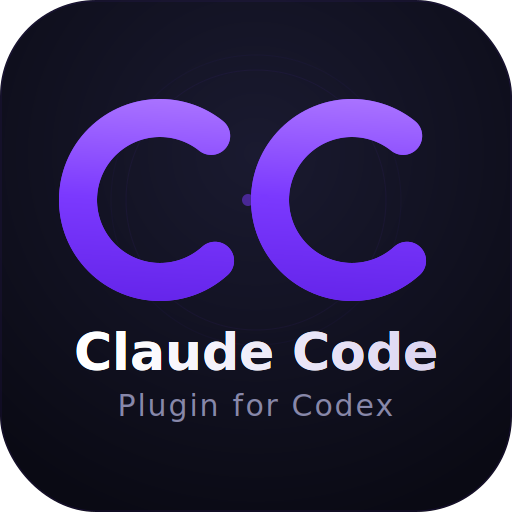

<p align="center">
  
</p>

<h3 align="center">Claude Code Plugin for Codex</h3>

<p align="center">
  Run Claude Code reviews, rescue tasks, and tracked background work from inside Codex.
</p>

<p align="center">
  <code>cc-plugin-codex</code> runs inside Codex and lets you use Claude Code and Claude models for review, rescue, and tracked background workflows.
</p>

<p align="center">
  <a href="#quick-start"><strong>Quick Start</strong></a> ·
  <a href="#commands"><strong>Commands</strong></a> ·
  <a href="#background-jobs"><strong>Background Jobs</strong></a> ·
  <a href="#review-gate"><strong>Review Gate</strong></a> ·
  <a href="#how-this-differs-from-upstream"><strong>vs Upstream</strong></a> ·
  <a href="https://github.com/sendbird/cc-plugin-codex/issues"><strong>Issues</strong></a>
</p>

---

## What Is This?

`cc-plugin-codex` turns Codex into a host for Claude Code work.
**Codex stays in charge of the thread. Claude Code does the review and rescue work.**

You get seven commands (`$cc:review`, `$cc:adversarial-review`, `$cc:rescue`, `$cc:status`, `$cc:result`, `$cc:cancel`, `$cc:setup`) that launch tracked Claude Code work, manage lifecycle and ownership, and surface results back into Codex.

That includes:
- Built-in Codex subagent orchestration for rescue and background review flows
- Session-scoped tracked jobs with status, result, and cancel commands
- Background completion nudges that steer you to the right `$cc:result <job-id>`
- An optional stop-time review gate
- GitHub CI coverage on Windows, macOS, and Linux

It follows the shape of [openai/codex-plugin-cc](https://github.com/openai/codex-plugin-cc) but runs in the opposite direction.

## Quick Start

### 1. Install

```bash
npx cc-plugin-codex install
```

That's the entire install. It:
- Copies the plugin to `~/.codex/plugins/cc`
- Activates the plugin through Codex app-server when available
- Falls back to config-based activation on older Codex builds
- Enables `codex_hooks = true`
- Installs lifecycle, review-gate, and unread-result hooks

On Windows, prefer the `npx` path above. The shell-script installer below is POSIX-only.
Codex CLI's official guidance still treats Windows support as experimental and recommends a WSL workspace for the best Codex experience. Claude Code supports both native Windows and WSL. In hosted CI we currently keep Windows on the native cross-platform core suite, while full integration and E2E coverage run on Linux and macOS.
The `npx` install path is the cross-platform path we test on every release.

> **Prerequisites:** Node.js 18+, Codex with hook support, and `claude` CLI installed and authenticated.
> If you don't have the Claude CLI yet:
> ```bash
> npm install -g @anthropic-ai/claude-code && claude auth login
> ```

### 2. Verify

Open Codex and run:

```text
$cc:setup
```

All checks should pass. If any fail, `$cc:setup` tells you what to fix.

### 3. Try It

```text
$cc:review --background
```

That launches a Claude Code review from a Codex-managed background flow. You can check on it immediately:

```text
$cc:status
$cc:result
```

When it finishes, Codex should nudge you toward the right result. If not, `$cc:status` and `$cc:result` are always the fallback.

## Commands

| Command | What It Does |
| --- | --- |
| `$cc:review` | Read-only Claude Code review of your changes |
| `$cc:adversarial-review` | Design-challenging review — questions approach, tradeoffs, hidden assumptions |
| `$cc:rescue` | Hand a task to Claude Code — bugs, fixes, investigations, follow-ups |
| `$cc:status` | List running and recent Claude Code jobs, or inspect one job |
| `$cc:result` | Open the output of a finished job |
| `$cc:cancel` | Cancel an active background job |
| `$cc:setup` | Verify installation, auth, hooks, and review gate |

Quick routing rule:
- Use `$cc:review` for straightforward correctness review of the current diff.
- Use `$cc:adversarial-review` for riskier config/template/migration/design changes, or whenever you want stronger challenge on assumptions and tradeoffs.
- Use `$cc:rescue` when you want Claude Code to investigate, validate by changing code, or actually fix/implement something.

### `$cc:review`

Standard read-only review of your current work.

```text
$cc:review                          # review uncommitted changes
$cc:review --base main              # review branch vs main
$cc:review --scope branch           # explicitly compare branch tip to base
$cc:review --background             # run in background, check with $cc:status later
$cc:review --model sonnet           # use a specific Claude model
```

**Flags:** `--base <ref>`, `--scope <auto|working-tree|branch>`, `--wait`, `--background`, `--model <model>`

Scope `auto` (the default) inspects `git status` and chooses between working-tree and branch automatically.

In foreground, review returns the result directly. In background, the plugin uses a Codex built-in subagent, tracks the review as a job, and nudges you to open the result when it completes.

If the diff is too large to inline safely, the review prompt falls back to concise status/stat context and tells Claude to inspect the diff directly with read-only `git diff` commands instead of failing the run.

### `$cc:adversarial-review`

Same as `$cc:review`, but steers Claude to challenge the implementation — tradeoffs, alternative approaches, hidden assumptions.

```text
$cc:adversarial-review
$cc:adversarial-review --background question the retry and rollback strategy
$cc:adversarial-review --base main challenge the caching design
```

Accepts the same flags as `$cc:review`, plus free-text focus after flags to steer the review.

Background adversarial review uses the same tracked built-in subagent pattern as `$cc:review`.

### `$cc:rescue`

Hand a task to Claude Code. This is the main way to delegate real work — bug fixes, investigations, refactors.

```text
$cc:rescue investigate why the tests started failing
$cc:rescue fix the failing test with the smallest safe patch
$cc:rescue --resume apply the top fix from the last run
$cc:rescue --background investigate the regression
$cc:rescue --model sonnet --effort medium investigate the flaky test
```

**Flags:**

| Flag | Description |
| --- | --- |
| `--background` | Run in background; check later with `$cc:status` |
| `--wait` | Run in foreground |
| `--resume` | Continue the most recent Claude Code task |
| `--resume-last` | Alias for `--resume` |
| `--fresh` | Force a new task (don't resume) |
| `--write` | Allow file edits (default) |
| `--model <model>` | Claude model (`sonnet`, `haiku`, or full ID) |
| `--effort <level>` | Reasoning effort: `low`, `medium`, `high`, `max` |
| `--prompt-file <path>` | Read task description from a file |

**Resume behavior:** If you don't pass `--resume` or `--fresh`, rescue checks for a resumable Claude session and asks once whether to continue or start fresh. Your phrasing guides the recommendation — "continue the last run" → resume, "start over" → fresh.

Background rescue runs through a built-in Codex subagent. When the child finishes, the plugin tries to nudge the parent thread with the exact `$cc:result <job-id>` to open.

### `$cc:status`

```text
$cc:status                          # list active and recent jobs
$cc:status task-abc123              # detailed status for one job
$cc:status --all                    # show all tracked jobs in this repository workspace
$cc:status --wait task-abc123       # block until job completes
```

By default, `$cc:status` shows jobs owned by the current Codex session. Use `--all` when you want the wider repository view across older or sibling sessions in the same workspace.

### `$cc:result`

```text
$cc:result                          # open the latest finished job for this session/repo
$cc:result task-abc123              # show finished job output
```

When a job came from a built-in background child, the output can show both:
- the **Claude Code session** you can resume with `claude --resume ...`
- the **Owning Codex session** that owns the tracked job inside Codex

To reopen the Claude Code session directly:

```bash
claude --resume <session-id>
```

### `$cc:cancel`

```text
$cc:cancel task-abc123              # cancel a running job
```

### `$cc:setup`

```text
$cc:setup                           # verify everything
$cc:setup --enable-review-gate      # turn on stop-time review gate
$cc:setup --disable-review-gate     # turn it off
```

Setup checks Claude Code availability, hook installation, and review-gate state. If hooks are missing, it reinstalls them. If Claude Code isn't installed, it offers to install it.

## Background Jobs

All review and rescue commands support `--background`. Background jobs are tracked per-session with full lifecycle management:

1. **Queued → Running → Completed** — jobs progress through states automatically.
2. **Built-in subagent background flows** — background rescue, review, and adversarial review use Codex-managed subagent turns rather than stuffing `--background` into the companion command itself.
3. **Completion nudges** — when a background built-in flow finishes, the plugin tries to nudge the parent thread with the right `$cc:result <job-id>`. If that nudge cannot surface cleanly, unread-result hooks are the backstop.
   The nudge is intentionally just a pointer. The actual stored result still opens through `$cc:result`.
4. **Unread-result fallback** — when you submit your next prompt after a finished unread job, Codex can remind you that a result is waiting and point you to `$cc:status` / `$cc:result`.
5. **Session ownership** — jobs stay attached to the user-facing parent Codex session even when a built-in rescue/review child does the actual work, so plain `$cc:status`, `$cc:result`, and resume-candidate detection still follow the parent thread.
6. **Cleanup on exit** — when your Codex session ends, any still-running detached jobs are terminated via PID identity validation, and stale reserved job markers are cleaned up over time.

**Typical background flow:**

```text
$cc:rescue --background investigate the performance regression
# ... keep working ...
# Codex nudges with the exact result command when possible
$cc:result task-abc123
```

### What “background” means here

- The parent Codex thread does not wait.
- The Claude companion command still runs in the foreground inside its own worker/subagent thread.
- For rescue and background review flows, the plugin prefers Codex built-in subagents and only uses job polling/status commands as the durable backstop.

## Review Gate

The review gate is an **optional** stop-time hook. When enabled, pressing Ctrl+C in Codex triggers a Claude Code review of the last Codex response before the stop is accepted.

- Claude returns `ALLOW:` → stop proceeds normally.
- Claude returns `BLOCK:` → stop is rejected; Codex continues.

**Caveats:**

- **Disabled by default.** Enable with `$cc:setup --enable-review-gate`.
- **Token cost.** Every Ctrl+C triggers a Claude invocation. This can drain usage limits quickly if you stop often.
- **15-minute timeout.** The gate has a hard timeout. If Claude doesn't respond, the stop is allowed.
- **Skip-on-no-edits.** The gate computes a working-tree fingerprint baseline and skips review when the last Codex turn made no net edits.
- **Not in nested sessions.** Child sessions (e.g., rescue subagents) suppress the gate to avoid feedback loops.

**Only enable when you're actively monitoring the session.**

## How This Differs From Upstream

| | [openai/codex-plugin-cc](https://github.com/openai/codex-plugin-cc) | This repository |
| --- | --- | --- |
| **Host** | Claude Code hosts the plugin | Codex hosts the plugin |
| **Commands** | `/codex:review`, `/codex:rescue`, … | `$cc:review`, `$cc:rescue`, … |
| **Runtime** | Codex app-server + broker | Fresh `claude -p` subprocess per invocation |
| **Review gate** | Reviews previous Claude response | Reviews previous Codex response |
| **Model flags** | Codex model names and effort controls | Claude model names and effort values (`low` / `medium` / `high` / `max`) |

### Where This Goes Further

- **Smart review gate** — fingerprints the working tree and skips review when the last Codex turn made no net edits, avoiding unnecessary token spend.
- **Nested-session awareness** — suppresses stop-time review and unread-result prompts in child runs, keeping interactive hooks attached to the user-facing thread only.
- **Tracked job ownership** — background jobs track unread/viewed state and session ownership, with safe PID-validated cleanup on session exit.
- **Built-in background notify** — rescue and review flows can now wake the parent thread and point directly to `$cc:result <job-id>` instead of relying only on later polling.
- **Unread-result nudges** — completed background jobs are still surfaced in your next prompt as a reliable fallback.
- **Idempotent installer** — manages plugin files, hooks, and config in a single atomic step. Safe to re-run for updates. Falls back gracefully on older Codex builds.

## Install Variants

### npx (recommended)

```bash
npx cc-plugin-codex install
```

### Shell script

```bash
curl -fsSL "https://raw.githubusercontent.com/sendbird/cc-plugin-codex/main/scripts/install.sh" | bash
```

### Local checkout

```bash
git clone https://github.com/sendbird/cc-plugin-codex.git ~/.codex/plugins/cc
cd ~/.codex/plugins/cc
node scripts/local-plugin-install.mjs install --plugin-root ~/.codex/plugins/cc
```

`local-plugin-install.mjs` expects `--plugin-root` to be the managed install directory itself. If you want to install from an arbitrary checkout path, use `npx cc-plugin-codex install` instead.

### Update

Re-run the install command — it's idempotent.

```bash
npx cc-plugin-codex update
```

### Uninstall

```bash
npx cc-plugin-codex uninstall
```

## Troubleshooting

**`$cc:setup` reports Claude Code not found**
```bash
npm install -g @anthropic-ai/claude-code
claude auth login
```

**Commands not recognized in Codex**
Re-run install. If your Codex build doesn't support `plugin/install`, the installer falls back to config-based activation and generates skill wrapper files automatically. You'll see a warning in the install output.

**Hooks not firing**
Check that `codex_hooks = true` is set in `~/.codex/config.toml` under `[features]`. Run `$cc:setup` to verify and auto-repair.

**A background job finished but I did not get the result nudge**
Use:
```text
$cc:status
$cc:result
```
The built-in notify path is best-effort. The tracked job store and unread hook remain the reliable fallback.

If you think the job may belong to an older session in the same repository, use:
```text
$cc:status --all
```

If a finished result shows both a **Claude Code session** and an **Owning Codex session**, use the Claude Code session for `claude --resume ...`. The owning session is there only to explain which Codex thread owns the tracked job.

**Large review diff caused a failure or was omitted**
That is expected on very large diffs. The plugin now degrades to a compact review context and points Claude toward read-only `git diff` commands instead of trying to inline everything. If you want the full picture, run a narrower review such as:
```text
$cc:review --base main
$cc:review --scope working-tree
```

**Review gate draining tokens**
Disable it: `$cc:setup --disable-review-gate`. The gate fires on every Ctrl+C, which adds up.

**Background jobs not cleaned up**
Jobs are terminated when the Codex session that owns them exits. If a session crashes without cleanup, use `$cc:status` and `$cc:cancel <job-id>` to clean up any leftovers.

## License

[Apache-2.0](LICENSE) — see [NOTICE](NOTICE) for attribution.
